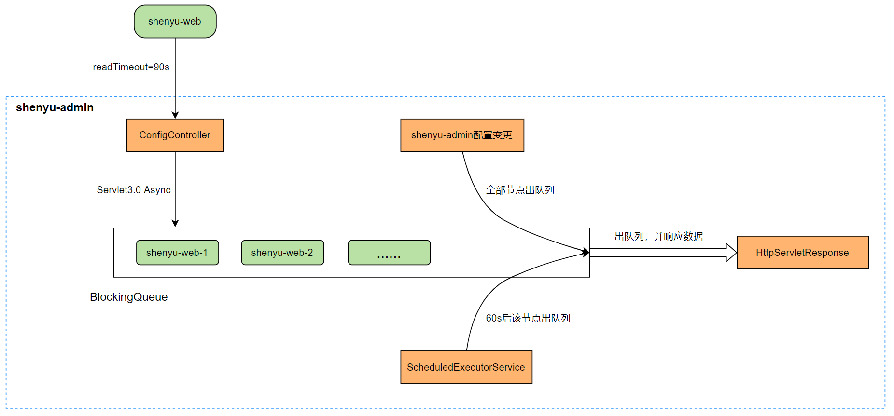

首先是 每个网关会向admin 发送请求，调用configController，然后利用Servlet3.0 异步的机制，将请求放入到一个阻塞队列里面，这个时候会释放入口请求的线程，单独一个线程继续等待处理。每个请求里面包括他现在订阅的Groups的所有信息，进configController的时候会先对比缓存数据，看groups是否有变化，如果有变化立即返回，没变化进去BlockingQueue等待，这个开始的机制也是一个查缺补漏的机制，防止后面通知中间间隙的遗漏。
如果中间没有变化，定时任务会在60s后删除刚才进请求端，防止超时。调度任务是在放入队列的适合创建的。
如果admin有配置变化，会将阻塞队列全部移除，然后判断变化，响应数据，但只通知到Group，网关接收到Group变化再拉取数据，这个是为了防止中间遗漏，http只能做到准实时，没法实时。
网关收到groups变化，拉取全部配置，更新内存。

看来看去这个机制依赖admin只能单机，不然配置变化通过spring 事件没法通知其他admin，但通过配置中心就没有这个问题。